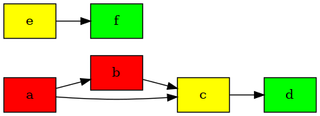
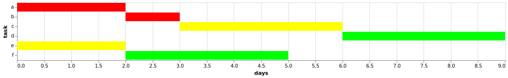

[](https://circleci.com/gh/PavlosMelissinos/henry)

## Description

Henry is a declarative generator of task dependency graphs and gantt charts.

The following libraries have been used:

1. [weavejester/dependency](https://github.com/weavejester/dependency) - to manipulate graphs
2. [macroz/tangle](https://github.com/macroz/tangle) - to visualize dependency graphs (png)
3. [metasoarous/oz](https://github.com/metasoarous/oz) - to visualize gantt charts (png/html)
4. [applied-science/darkstar](https://github.com/applied-science/darkstar) - to visualize gantt charts (svg)
5. [stathisideris/dali](https://github.com/stathissideris/dali) - to rasterize images (svg to png)

## Setup

Add the project to your deps.edn file:

```clojure
{:deps [henry {:git/url "https://github.com/PavlosMelissinos/henry.git"
               :sha ???}]}
```

## Features

### Common task definition format

```clojure
{:description  "Project X roadmap"
 :tasks        [{:id :a :duration 2 :styles [:critical]}
                {:id :b :duration 1 :styles [:critical]}
                {:id :c :duration 3 :styles [:major]}
                {:id :d :duration 3 :styles [:trivial]}
                {:id :e :duration 2 :styles [:major]}
                {:id :f :duration 3 :styles [:trivial]}]
 :dependencies [[:b :a] [:c :b] [:c :a] [:d :c] [:f :e]]
 :styles       {:critical {:fillcolor "#FF0000" :style "filled"}
                :major    {:fillcolor "#FFFF00" :style "filled"}
                :trivial  {:fillcolor "#00FF00" :style "filled"}}}
```

### Task dependency graphs

```clojure
(ns example.core
  (:require [henry.core :as henry]))

;; Load the spec
(def spec (henry/load-edn "test_resources/data.edn"))

;; Given a spec, translate to dot syntax
(def deps (henry/convert spec :deps :dot))

;; Given a spec, generate a png using graphviz
(henry/export spec :deps :png "test_resources/data.deps.png")
```

Results in:



### Gantt charts

```clojure
(ns example.core
  (:require [henry.core :as henry]))

;; Load the spec
(def spec (henry/load-edn "test_resources/data.edn"))

;; Given a spec, translate to vega-lite (json)
(henry/convert spec :gantt :json)

;; Given a spec, export to svg file
(henry/export spec :gantt :svg "test_resources/data.gantt.svg")
```

Results in:



## To-Do

* [ ] Add specs!
* [ ] Improve vega-lite defaults
* [ ] Polish/fix bugs
* [ ] Support hiccup syntax in styles?
* [ ] [Dali](https://github.com/stathissideris/dali) vs vega-lite (via oz)?
* [ ] Also maybe [documan](https://github.com/tesni-manu/documan) (based on dali) to generate sequence diagrams?
* [ ] Support exporting dependency graphs to svg (tangle/dot not working properly? investigate)
