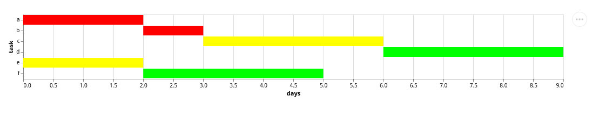

## Description

Henry is a declarative generator of task dependency graphs and gantt charts.

The following libraries have been used:

1. [Engelberg/ubergraph](https://github.com/Engelberg/ubergraph), [jafingerhut/cljol](https://github.com/jafingerhut/cljol) - to manipulate graphs
2. [macroz/tangle](https://github.com/macroz/tangle) - to visualize dependency graphs
3. [metasoarous/oz](https://github.com/metasoarous/oz) - to visualize gantt charts

## Setup

Add the project to your deps.edn:

```clojure
{:deps [henry {:git/url "https://github.com/PavlosMelissinos/henry.git"
               :sha ???}]}
```

## Features

### Common task definition format

```clojure
{:description  "Project X roadmap"
 :tasks        [{:id :a :duration 2 :styles [:critical]}
                {:id :b :duration 1 :styles [:critical]}
                {:id :c :duration 3 :styles [:major]}
                {:id :d :duration 3 :styles [:trivial]}
                {:id :e :duration 2 :styles [:major]}
                {:id :f :duration 3 :styles [:trivial]}]
 :dependencies [[:b :a] [:c :b] [:c :a] [:d :c] [:f :e]]
 :styles       {:critical {:fillcolor "#FF0000" :style "filled"}
                :major    {:fillcolor "#FFFF00" :style "filled"}
                :trivial  {:fillcolor "#00FF00" :style "filled"}}}
```

### Task dependency graphs

Require in your namespace

```clojure
(ns example.core
  (:require [henry.core :as henry]))
```

Load the file and generate a task dependency graph

```clojure
(def dep-graph (henry/build :tasks (henry/load-edn "test_resources/data.edn")))
```

`(henry/tasks->png dep-graph "test_resources/data.tasks.png")` results in:


### Gantt charts

Require in your namespace

```clojure
(ns example.core
  (:require [henry.core :as henry]))
```

Load the file and generate a task dependency graph

```clojure
(def gantt-def (henry/build :gantt (henry/load-gantt-config "test_resources/data.edn")))
```

`(henry/gantt->json gantt-def "test_resources/data.gantt.json")` to get a [vega-lite compatible json file](doc/images/data.gantt.json)

`(henry/gantt->html gantt-def "test_resources/data.gantt.html")` to get the gantt chart as a html document




## To-Do

* [ ] Improve vega-lite defaults
* [ ] Maybe replace ubergraph with [stuartsierra/dependencies]((https://github.com/metasoarous/oz))
* [ ] Polish/fix bugs
* [ ] Single internal representation for both
* [ ] Export gantt charts to svg (checkout [applied-science/darkstar](https://github.com/applied-science/darkstar))
* [ ] Support hiccup syntax in styles?
* [ ] [Dali](https://github.com/stathissideris/dali) vs vega-lite (via oz) for more freedom?
* [ ] Also maybe [documan](https://github.com/tesni-manu/documan) (based on dali) to generate sequence diagrams?
